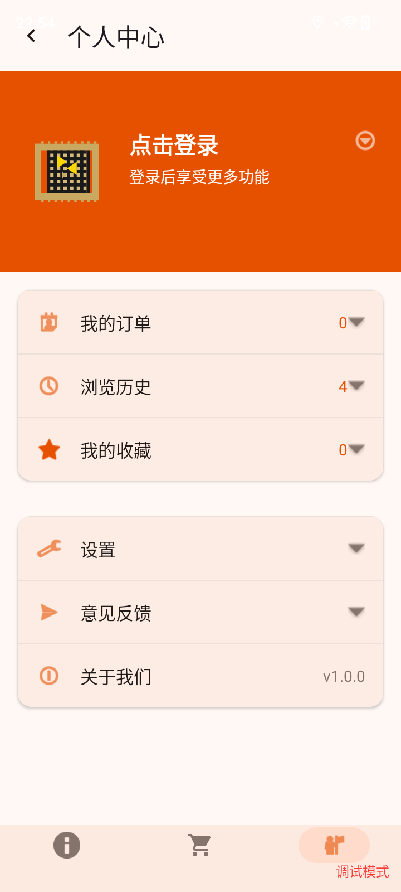

## 阿博电影 (boMovie)

一款基于猫眼电影接口的 Android 电影资讯与购票 App，采用传统 Activity + XML 架构开发。

### 技术栈

- **语言**: Java
- **网络请求**: Retrofit + OkHttp
- **数据解析**: Gson
- **图片加载**: Glide
- **UI框架**: Material Design 3
- **架构**: Activity + RecyclerView + SharedPreferences

### 接口来源

[猫眼电影 API](https://apis.netstart.cn/maoyan/)

### 功能特性

#### 🎬 核心功能
- **正在热映** - 获取当前院线热映电影列表，展示海报、片名、评分
- **即将上映** - 查看即将上映的电影及上映日期
- **最受期待** - 横向卡片展示最受期待的电影，包含想看人数和上映日期
- **电影详情** - 查看电影详细信息，包括海报、评分、简介、演职人员等

#### 🔍 搜索功能
- **电影搜索** - 支持关键词搜索电影，输入时实时显示搜索建议
- **搜索历史** - 自动保存搜索记录，方便快速查找

#### 📍 定位功能
- **城市切换** - 支持切换当前城市，热门城市快速选择
- **GPS定位** - 自动定位当前城市，超时自动 fallback 到 IP 定位
- **城市搜索** - 支持按名称/拼音搜索城市

#### 🔐 登录系统
- **手机号登录** - 带短信验证码模拟（60秒倒计时）
- **微信登录** - 一键快捷登录
- **QQ登录** - 一键快捷登录
- **用户状态** - 登录状态持久化存储

#### 🛒 购物车系统
- **加入购物车** - 电影详情页一键添加到购物车
- **数量管理** - 支持数量加减、删除商品
- **全选功能** - 一键全选/取消全选
- **购物车角标** - 底部导航栏实时显示购物车数量

#### 🎫 购票流程
- **选座界面** - 可视化座位选择（40个座位，5×8布局）
- **订单确认** - 显示影片、影院、场次、座位、价格信息
- **支付方式** - 支持微信/支付宝支付
- **支付成功** - 支付完成后跳转成功页面

#### ❤️ 收藏功能
- **电影收藏** - 详情页点击星标收藏/取消收藏
- **收藏列表** - 个人中心查看所有收藏电影

#### 👤 个人中心
- **我的订单** - 查看历史订单记录
- **浏览历史** - 自动记录浏览过的电影
- **我的收藏** - 查看收藏的电影
- **设置** - 退出登录功能
- **意见反馈** - 提交用户反馈
- **关于我们** - 版本信息展示

#### 🧭 底部导航
- **首页** - 电影列表页面
- **购物车** - 购物车页面
- **我的** - 个人中心页面

### 项目结构

```
boMovie/
├── app/src/main/
│   ├── java/com/biubiupapa/movie/
│   │   ├── MainActivity.java              # 主页面
│   │   ├── DetailActivity.java            # 电影详情页
│   │   ├── CityPickerActivity.java        # 城市选择页
│   │   ├── SearchActivity.java            # 电影搜索页
│   │   ├── LoginActivity.java             # 登录页面
│   │   ├── CartActivity.java              # 购物车页面
│   │   ├── OrderActivity.java             # 订单确认页
│   │   ├── OrderListActivity.java         # 订单列表页
│   │   ├── PaySuccessActivity.java        # 支付成功页
│   │   ├── ProfileActivity.java           # 个人中心页
│   │   ├── SeatSelectActivity.java        # 座位选择页
│   │   ├── adapter/                       # 适配器
│   │   │   ├── MovieAdapter.java
│   │   │   ├── BannerAdapter.java
│   │   │   ├── ExpectedAdapter.java
│   │   │   └── SearchResultAdapter.java
│   │   ├── model/                         # 数据模型
│   │   │   ├── Movie.java
│   │   │   ├── City.java
│   │   │   ├── TicketRecord.java
│   │   │   └── ... (其他响应模型)
│   │   └── util/                          # 工具类
│   │       ├── ApiService.java            # API 接口定义
│   │       ├── RetrofitClient.java        # Retrofit 客户端
│   │       ├── CartManager.java           # 购物车管理
│   │       ├── OrderManager.java          # 订单管理
│   │       ├── FavoritesManager.java      # 收藏管理
│   │       └── HistoryManager.java        # 历史记录管理
│   └── res/
│       ├── layout/                        # 布局文件
│       ├── drawable/                      # 图标资源
│       ├── menu/                          # 菜单资源
│       └── color/                         # 颜色资源
├── .github/
│   ├── workflows/build.yml                # CI 自动构建
│   └── ISSUE_TEMPLATE/                    # Issue 模板
├── screenshots/                           # 效果截图
├── CHANGELOG.md                           # 版本更新记录
├── LICENSE                                # 开源协议
├── build.gradle
└── settings.gradle
```

### 编译与运行

**环境要求：**
- Android Studio
- JDK 21
- Android SDK (compileSdk 36, minSdk 26)

**运行方式：**

使用 Android Studio 打开项目，连接设备或模拟器后直接运行。

```bash
# 或通过命令行编译
./gradlew assembleDebug

# 安装到设备
adb install app/build/outputs/apk/debug/app-debug.apk
```

### 效果展示

| 页面 | 截图 |
|------|------|
| 首页 |  |
| 电影详情 |  |
| 城市选择 |  |
| 个人中心 |  |
| 购物车 |  |

### 更新日志

查看 [CHANGELOG.md](CHANGELOG.md) 了解版本更新历史。

### 开源协议

本项目基于 [Apache-2.0](LICENSE) 协议开源。
